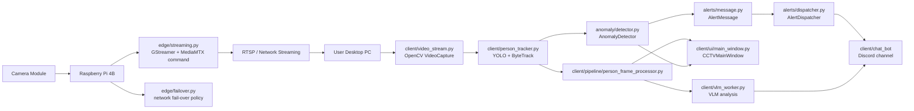
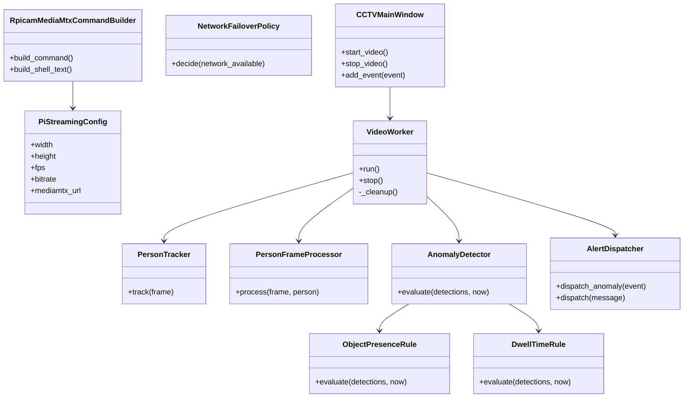

# AI CCTV Flow

이 문서는 종합설계 프로젝트 요약 문서 기준에 맞춘 AI CCTV 코드 구조와 실행 흐름을 설명합니다.

## Project Layout

```text
AI_CCTV/
├─ main.py                         # 로컬 개발 실행 진입점
├─ structure.md                    # 파일별 클래스/함수 구조 표
├─ flow.md                         # 실행 흐름과 책임 경계 문서
├─ src/ai_cctv/
│  ├─ edge/                        # Raspberry Pi GStreamer 송출 및 장애 대응 정책
│  ├─ anomaly/                     # 객체 감지 결과 기반 이상 상황 판단
│  ├─ alerts/                      # Discord, KakaoTalk, LoRa 확장용 알림 계층
│  ├─ client/                      # 사용자 PC 기반 영상 수신/분석/GUI
│  │  ├─ pipeline/                 # 프레임 단위 인물 처리
│  │  ├─ storage/                  # PC 저장 경로 규칙
│  │  ├─ ui/                       # PyQt 메인 화면과 이벤트 표시
│  │  └─ chat_bot/                 # 기존 Discord 전송 구현
│  ├─ streaming/                   # RTSP 송수신 실험 및 레거시 유틸리티
│  └─ server/                      # 서버 보조 모듈 자리
├─ docs/                           # 설계/학습 문서
├─ scripts/                        # 운영 스크립트
├─ tests/                          # 장비 비의존 단위 테스트
└─ tmp/                            # 임시/레거시 자료
```

## System Flow



## Responsibility Boundaries



## Document Alignment

| 프로젝트 문서 기준 | 코드 구조 |
|---|---|
| Raspberry Pi 4B와 카메라 모듈 기반 송출 | `edge/streaming.py`에서 GStreamer + MediaMTX RTSP publish 명령 구조 제공 |
| RTSP 기반 실시간 전송 | `client/video_stream.py`, `streaming/` 패키지 |
| PC 기반 OpenCV/YOLO 분석 | `client/video_worker.py`, `client/person_tracker.py` |
| 이상 상황 판단 | `anomaly/detector.py`의 규칙 기반 판단 계층 |
| 챗봇 알림 전송 | `alerts/` 패키지와 기존 `client/chat_bot/` 연동 구조 |
| 네트워크 장애 대응 | `edge/failover.py`의 스트리밍/로컬저장/최소알림 정책 |
| microSD/LoRa 확장 | `edge/failover.py`, `alerts/dispatcher.py`에서 확장 지점 제공 |

## Execution

로컬 개발 환경에서는 프로젝트 루트에서 다음 명령으로 실행합니다.

```bash
python main.py
```

패키지 설치 환경에서는 console script를 사용할 수 있습니다.

```bash
pip install -e .
ai-cctv
```

구조 검증은 다음 명령으로 수행합니다.

```bash
python -m compileall src main.py
$env:PYTHONPATH="src"; python -m unittest discover -s tests
```
