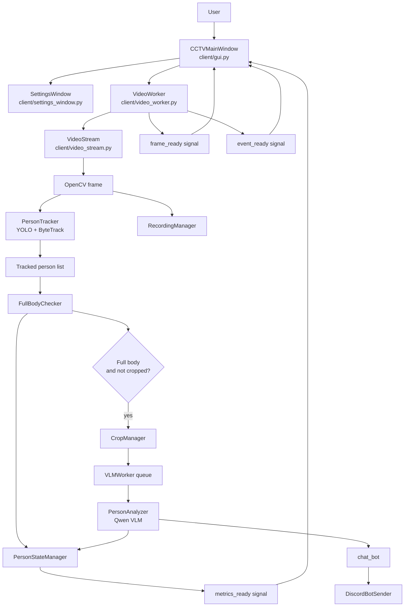
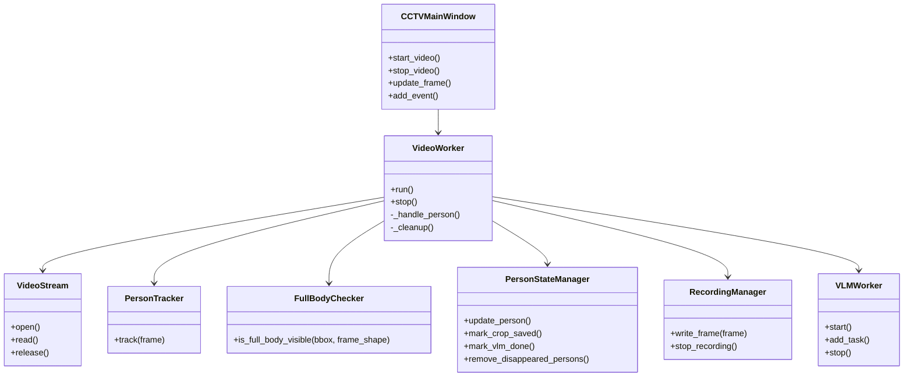

# AI CCTV Flow

이 문서는 `refactor` 브랜치 기준 프로젝트 구조와 런타임 흐름을 설명한다.

## Project Layout

```text
AI_CCTV/
├── src/ai_cctv/
│   ├── client/          # PyQt GUI, video processing, VLM, recording, chatbot
│   ├── server/          # server-side helpers
│   └── streaming/       # RTSP sender/receiver utilities
├── docs/                # design notes, study documents, RTSP docs
├── tmp/                 # legacy demos and temporary files
├── scripts/             # operational shell scripts
├── main.py              # local development entrypoint
└── pyproject.toml       # Python package metadata
```

## Runtime Flow



## Responsibility Boundaries



## Execution

로컬 개발에서는 루트에서 다음 명령으로 실행한다.

```bash
python main.py
```

패키지로 설치한 환경에서는 console script를 사용할 수 있다.

```bash
pip install -e .
ai-cctv
```
