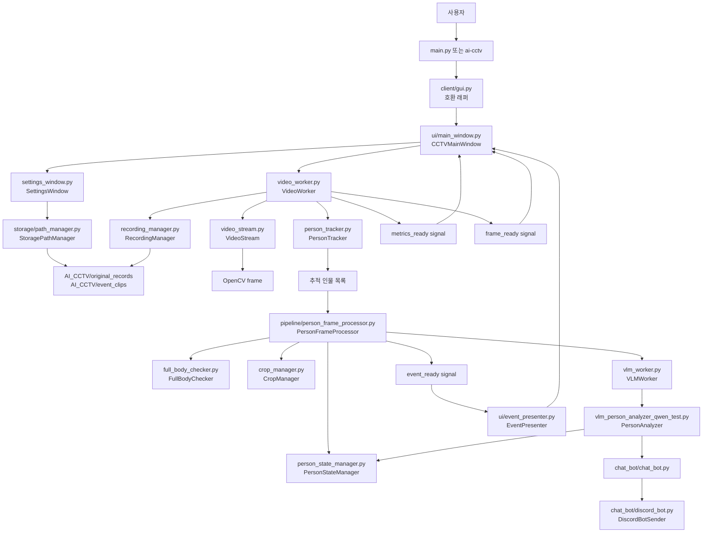
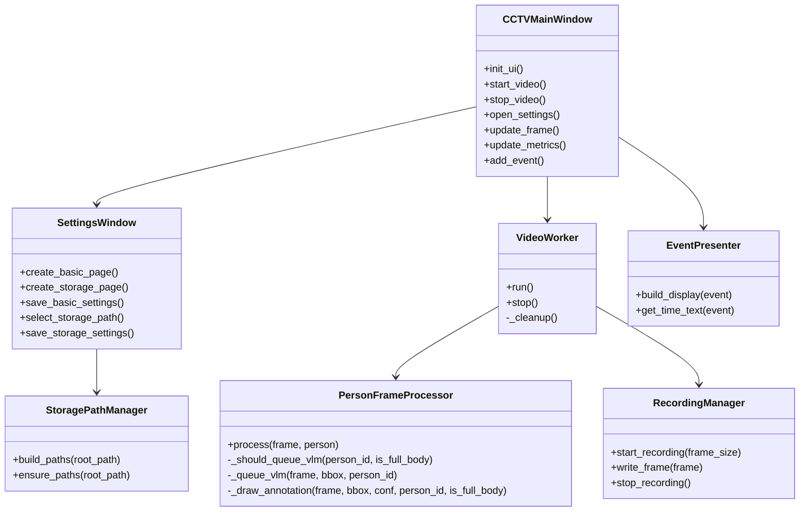

# AI CCTV Flow

이 문서는 객체 지향 책임 분리 이후의 프로젝트 구조와 실행 흐름을 설명합니다.

## Project Layout

```text
AI_CCTV/
├─ main.py                         # 로컬 개발 실행 진입점
├─ structure.md                    # 파일별 클래스/함수 구조 표
├─ flow.md                         # 실행 흐름과 책임 경계 문서
├─ src/ai_cctv/
│  ├─ __main__.py                  # python -m ai_cctv 진입점
│  ├─ client/
│  │  ├─ gui.py                    # 기존 GUI import 호환 래퍼
│  │  ├─ settings_window.py        # 설정 대화상자
│  │  ├─ video_worker.py           # 영상 처리 스레드 조정자
│  │  ├─ pipeline/                 # 프레임 처리 파이프라인 책임
│  │  ├─ storage/                  # 저장 경로 규칙과 폴더 생성 책임
│  │  ├─ ui/                       # 메인 창과 이벤트 표시 책임
│  │  ├─ chat_bot/                 # 챗봇/Discord 메시지 전송
│  │  └─ vision 관련 모듈          # 추적, crop, 전신 판정, 얼굴 식별, VLM
│  ├─ streaming/                   # RTSP 송수신 유틸리티
│  └─ server/                      # 서버 보조 모듈
├─ docs/                           # 설계/학습 문서
├─ scripts/                        # 운영 스크립트
└─ tmp/                            # 임시/레거시 자료
```

## Runtime Flow



## Responsibility Boundaries



## Execution

로컬 개발 환경에서는 프로젝트 루트에서 다음 명령으로 실행합니다.

```bash
python main.py
```

패키지 설치 환경에서는 console script를 사용할 수 있습니다.

```bash
pip install -e .
ai-cctv
```

구조 검증은 다음 명령으로 수행했습니다.

```bash
python -m compileall src main.py
```
