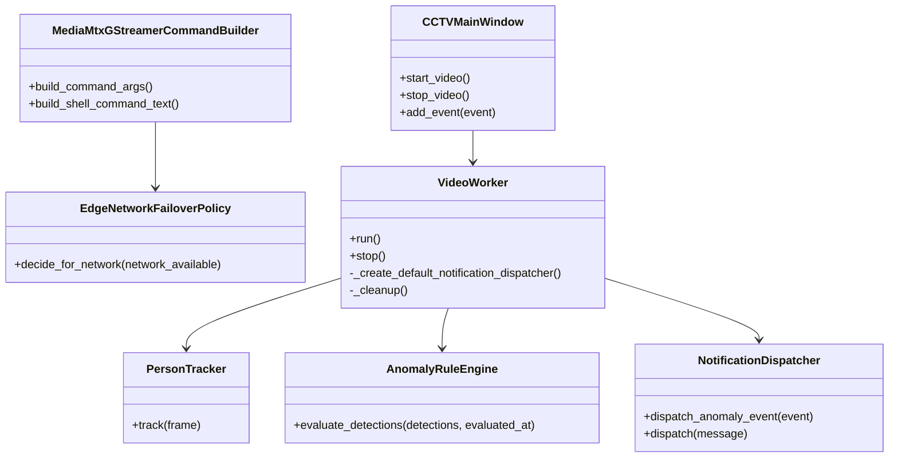

# AI CCTV Flow

이 문서는 최종 배포 목표인 Edge node 실행 묶음과 AI server 실행 묶음을 기준으로 프로젝트 구조와 실행 흐름을 설명합니다.

## Project Layout

```text
AI_CCTV/
|-- main.py                         # 로컬 개발용 AI server 실행 진입점
|-- README.md                       # 프로젝트 개요와 설치 안내
|-- pyproject.toml                  # 패키지 메타데이터와 실행 명령
|-- requirements/                   # 배포 환경별 requirements 파일
|-- inst/                           # 구조, 흐름, 변경 설명 문서
|   |-- structure.md                # 파일별 클래스/함수 구조 표
|   |-- flow.md                     # 실행 흐름과 책임 경계 문서
|   `-- change.md                   # develop 대비 변경 설명
|-- src/
|   `-- ai_cctv/
|       |-- edge_node/              # Raspberry Pi Edge node 배포 단위
|       |   |-- main.py             # Edge node 송출 명령 진입점
|       |   |-- streaming.py        # GStreamer + MediaMTX RTSP publish 명령 생성
|       |   `-- failover.py         # 네트워크 장애 대응 정책
|       `-- ai_server/              # Windows AI server 배포 단위
|           |-- main.py             # AI server GUI/분석 진입점
|           |-- analysis.py         # 서버 분석 계층 재노출
|           |-- stream_receiver.py  # MediaMTX RTSP 수신 수동 점검 도구
|           |-- control_center/     # GUI, 영상 루프, 추적, 녹화, VLM 구현
|           |-- anomaly/            # 이상 상황 판정 규칙과 이벤트
|           |-- alerts/             # Discord 알림 메시지와 디스패처
|           `-- common/             # 서버 노드 내부 공통 값 객체 재노출
|-- tests/                          # 구조와 도메인 경계 단위 테스트
|-- docs/                           # 설계/학습 문서
`-- scripts/                        # 운영 보조 스크립트
```

## Deployment Bundles

| 실행 묶음 | 설치 extras | console script | 주요 책임 |
|---|---|---|---|
| Edge node | `ai-cctv[edge-node]` | `ai-cctv-edge` | 카메라 송출, MediaMTX publish 명령 생성, 네트워크 장애 대응 정책 |
| AI server | `ai-cctv[ai-server]` | `ai-cctv-ai-server` 또는 `ai-cctv` | RTSP 수신, OpenCV/YOLO 분석, 이상 상황 판정, Discord 알림, GUI |

## System Flow

```mermaid
flowchart LR
    Camera["Camera Module"] --> Pi["Raspberry Pi 4B"]
    Pi --> EdgeMain["ai_cctv/edge_node/main.py"]
    EdgeMain --> StreamBuilder["MediaMtxGStreamerCommandBuilder"]
    Pi --> Failover["EdgeNetworkFailoverPolicy"]
    StreamBuilder --> MediaMTX["MediaMTX RTSP publish"]
    MediaMTX --> RTSP["RTSP Stream"]
    RTSP --> Windows["ai_cctv/ai_server/main.py"]
    Windows --> VideoWorker["ai_server/control_center/video_worker.py"]
    VideoWorker --> Tracker["PersonTracker"]
    Tracker --> Processor["PersonFrameProcessor"]
    Tracker --> RuleEngine["AnomalyRuleEngine"]
    RuleEngine --> Event["AnomalyEvent"]
    Event --> Dispatcher["NotificationDispatcher"]
    Dispatcher --> Discord["Discord"]
    Processor --> GUI["CCTVMainWindow"]
```



## Responsibility Boundaries



## Execution

로컬 개발 환경에서 AI server는 다음 명령으로 실행합니다.

```bash
python main.py
```

배포 환경에서는 실행 묶음별 extras와 console script를 사용합니다.

```bash
pip install -e ".[edge-node]"
ai-cctv-edge
```

```bash
pip install -e ".[ai-server]"
ai-cctv-ai-server
```

검증 명령은 다음과 같습니다.

```bash
python -m compileall src main.py tests
$env:PYTHONPATH="src"; python -m unittest discover -s tests
```
