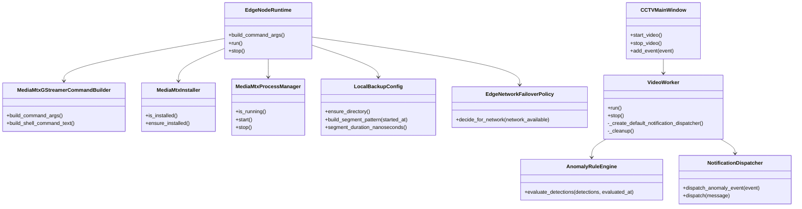

# AI CCTV Flow

이 문서는 Edge node와 AI server 두 실행 묶음을 기준으로 프로젝트 구조와 실행 흐름을 설명합니다.

## Project Layout

```text
AI_CCTV/
|-- main.py                         # 로컬 개발용 AI server 실행 진입점
|-- pyproject.toml                  # 패키지 메타데이터와 실행 명령
|-- requirements/                   # 배포 환경별 requirements 파일
|-- inst/                           # 구조, 흐름, 변경 설명 문서
|-- src/
|   `-- ai_cctv/
|       |-- edge_node/              # Raspberry Pi Edge node 배포 단위
|       |   |-- main.py             # Edge node 실행 진입점
|       |   |-- runtime.py          # MediaMTX 준비와 GStreamer 실행 조율
|       |   |-- mediamtx.py         # MediaMTX 다운로드, 설치 확인, 프로세스 관리
|       |   |-- streaming.py        # GStreamer 송출/로컬 백업 파이프라인 생성
|       |   |-- local_backup.py     # 로컬 백업 세그먼트 파일명 정책
|       |   `-- failover.py         # 네트워크 장애 대응 정책
|       `-- ai_server/              # Windows AI server 배포 단위
|           |-- server_run.py       # AI server 실행 진입점
|           |-- stream_receiver.py  # MediaMTX RTSP 수신 수동 점검 도구
|           |-- ui/                 # PyQt 화면, 설정창, 이벤트 표시
|           |-- analysis/           # 영상 입력, 추적, VLM, 이상 상황 판정
|           |-- storage/            # 저장 경로와 녹화 관리
|           |-- alerts/             # Discord 알림 메시지, 디스패처, 챗봇 전송
|           `-- common/             # 서버 노드 내부 공통 값 객체 재노출
`-- tests/                          # 구조와 도메인 경계 단위 테스트
```

## Deployment Bundles

| 실행 묶음 | 설치 extras | console script | 주요 책임 |
|---|---|---|---|
| Edge node | `ai-cctv[edge-node]` | `ai-cctv-edge` | 카메라 송출, MediaMTX 실행, 로컬 백업, 네트워크 장애 대응 정책 |
| AI server | `ai-cctv[ai-server]` | `ai-cctv-ai-server` 또는 `ai-cctv` | RTSP 수신, OpenCV/YOLO 분석, 이상 상황 판정, Discord 알림, GUI |

## System Flow

```mermaid
flowchart LR
    Camera["Camera Module"] --> Pi["Raspberry Pi 4B"]
    Pi --> EdgeMain["ai_cctv/edge_node/main.py"]
    EdgeMain --> EdgeRuntime["EdgeNodeRuntime"]
    EdgeRuntime --> MediaMtxManager["MediaMtxInstaller / MediaMtxProcessManager"]
    EdgeRuntime --> BackupConfig["LocalBackupConfig"]
    EdgeRuntime --> StreamBuilder["MediaMtxGStreamerCommandBuilder"]
    Pi --> Failover["EdgeNetworkFailoverPolicy"]
    StreamBuilder --> BackupFiles["10초 단위 로컬 TS 백업"]
    StreamBuilder --> MediaMTX["로컬 MediaMTX RTMP publish"]
    MediaMTX --> RTSP["RTSP Stream"]
    RTSP --> ServerRun["ai_cctv/ai_server/server_run.py"]
    ServerRun --> MainWindow["ai_server/ui/main_window.py"]
    MainWindow --> VideoWorker["ai_server/analysis/video_worker.py"]
    VideoWorker --> Tracker["PersonTracker"]
    Tracker --> Processor["PersonFrameProcessor"]
    Tracker --> RuleEngine["AnomalyRuleEngine"]
    VideoWorker --> Storage["storage/recording_manager.py"]
    RuleEngine --> Event["AnomalyEvent"]
    Event --> Dispatcher["NotificationDispatcher"]
    Dispatcher --> Discord["alerts/chat_bot"]
    Processor --> GUI["CCTVMainWindow"]
```



## Responsibility Boundaries



## Execution

```bash
pip install -e ".[edge-node]"
ai-cctv-edge
```

```bash
pip install -e ".[ai-server]"
ai-cctv-ai-server
```

검증 명령은 다음과 같습니다.

```bash
python -m compileall src main.py tests
$env:PYTHONPATH="src"; python -m unittest discover -s tests
```
