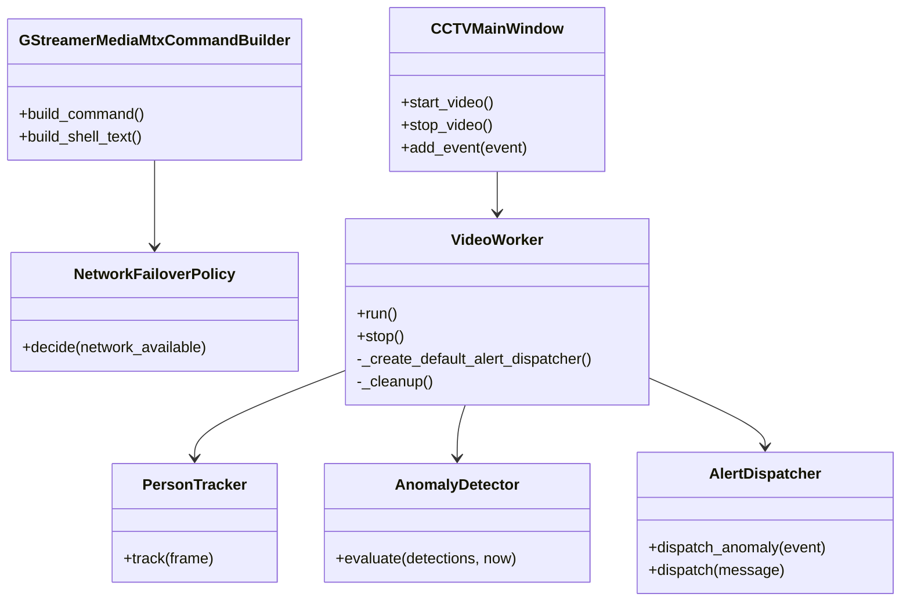

# AI CCTV Flow

이 문서는 최종 배포 목표인 Edge node 실행 묶음과 AI server 실행 묶음을 기준으로 프로젝트 구조를 설명합니다.

## Project Layout

```text
AI_CCTV/
├─ main.py                         # 로컬 개발용 AI server 실행 진입점
├─ README.md                       # 프로젝트 개요와 설치 안내
├─ pyproject.toml                  # 패키지 메타데이터와 실행 명령
├─ requirements/                   # 실행 환경별 requirements 파일
├─ inst/                           # 구조/흐름/변경 설명 문서와 보관 자료
│  ├─ structure.md                 # 파일별 클래스/함수 구조 표
│  ├─ flow.md                      # 실행 흐름과 책임 경계 문서
│  ├─ change.md                    # develop 대비 변경 설명
│  └─ archive/tmp/                 # 임시/샘플 자료 보관 위치
├─ src/
│  └─ ai_cctv/                     # 프로젝트 단일 루트 패키지
│     ├─ edge_node/                # Edge node 전용 실행 묶음
│     │  ├─ main.py                # Edge node 송출 명령 진입점
│     │  ├─ streaming.py           # GStreamer + MediaMTX RTSP publish 명령
│     │  └─ failover.py            # 네트워크 장애 대응 정책
│     ├─ ai_server/                # AI server 전용 실행 묶음
│     │  ├─ main.py                # AI server GUI/분석 진입점
│     │  ├─ analysis.py            # 분석 계층 재노출
│     │  └─ alerts.py              # Discord 알림 계층 재노출
│     ├─ common/                   # 플랫폼 공통 이벤트/메시지 값 객체
│     ├─ client/                   # 기존 Windows GUI/분석 구현
│     ├─ anomaly/                  # 이상 상황 판단 구현
│     ├─ alerts/                   # 현재 Discord 중심 알림 구현과 확장 인터페이스
│     ├─ streaming/                # RTSP 데모/레거시 유틸리티
│     └─ server/                   # 서버 보조 모듈 자리
├─ tests/                          # 장비 비의존 구조 테스트
├─ docs/                           # 설계/학습 문서
└─ scripts/                        # 운영 스크립트
```

## Deployment Bundles

| 실행 묶음 | 설치 extras | console script | 주요 책임 |
|---|---|---|---|
| Edge node | `ai-cctv[edge-node]` | `ai-cctv-edge` | 카메라 송출, MediaMTX publish, 네트워크 장애 정책 |
| AI server | `ai-cctv[ai-server]` | `ai-cctv-ai-server` 또는 `ai-cctv` | RTSP 수신, OpenCV/YOLO 분석, 이상 상황 판단, Discord 알림, GUI |

## System Flow

```mermaid
flowchart LR
    Camera["Camera Module"] --> Pi["Raspberry Pi 4B"]
    Pi --> EdgeMain["ai_cctv/edge_node/main.py"]
    EdgeMain --> GStreamer["ai_cctv/edge_node/streaming.py<br/>GStreamer + MediaMTX"]
    Pi --> Failover["ai_cctv/edge_node/failover.py<br/>network policy"]
    GStreamer --> RTSP["RTSP Stream"]
    RTSP --> Windows["ai_cctv/ai_server/main.py"]
    Windows --> VideoWorker["client/video_worker.py"]
    VideoWorker --> Tracker["client/person_tracker.py<br/>YOLO + ByteTrack"]
    Tracker --> Processor["client/pipeline/person_frame_processor.py"]
    Tracker --> Anomaly["anomaly/detector.py"]
    Anomaly --> CommonEvent["common/events.py"]
    CommonEvent --> Alerts["alerts/dispatcher.py<br/>Discord default"]
    Alerts --> User["User"]
    Processor --> GUI["client/ui/main_window.py"]
```



## Responsibility Boundaries



## Execution

로컬 개발 환경에서 AI server는 다음 명령으로 실행합니다.

```bash
python main.py
```

설치 환경에서는 실행 묶음별 extras와 console script를 사용합니다.

```bash
pip install -e ".[edge-node]"
ai-cctv-edge
```

```bash
pip install -e ".[ai-server]"
ai-cctv-ai-server
```

검증 명령은 다음과 같습니다.

```bash
python -m compileall src main.py tests
$env:PYTHONPATH="src"; python -m unittest discover -s tests
```
