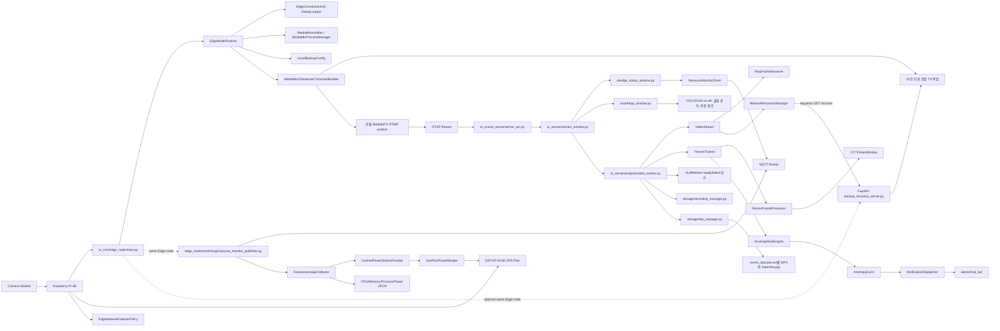

# AI CCTV Flow

이 문서는 Edge node와 AI server 두 실행 묶음을 기준으로 프로젝트 구조와 실행 흐름을 설명합니다.

## Project Layout

```text
AI_CCTV/
|-- main.py                         # 로컬 개발용 AI server 실행 진입점
|-- pyproject.toml                  # 패키지 메타데이터와 실행 명령
|-- requirements/                   # 배포 환경별 requirements 파일
|-- inst/                           # 구조, 흐름, 변경 설명 문서
|-- src/
|   `-- ai_cctv/
|       |-- edge_node/              # Raspberry Pi Edge node 배포 단위
|       |   |-- main.py             # Edge node 실행 진입점
|       |   |-- runtime.py          # MediaMTX 준비와 GStreamer 실행 조율
|       |   |-- startup_info.py     # SSH 실행 직후 AI server 설정용 연결 정보 출력
|       |   |-- mediamtx.py         # MediaMTX 다운로드, 설치 확인, 프로세스 관리
|       |   |-- streaming.py        # GStreamer 송출/로컬 백업 파이프라인 생성
|       |   |-- local_backup.py     # 로컬 백업 세그먼트 파일명 정책
|       |   |-- backup_recovery_server.py # 누락 구간 로컬 백업 ZIP 제공
|       |   |-- monitoring/         # Edge node 자원/전원 모니터링 MQTT publisher
|       |   `-- failover.py         # 네트워크 장애 대응 정책
|       `-- ai_server/              # Windows AI server 배포 단위
|           |-- server_run.py       # AI server 실행 진입점
|           |-- stream_receiver.py  # MediaMTX RTSP 수신 수동 점검 도구
|           |-- ui/                 # PyQt 화면, 설정창, 이벤트 표시
|           |-- analysis/           # 영상 입력, RTSP 재연결, 추적, VLM, 이상 상황 판정
|           |-- recovery/           # RTSP 단절 구간 백업 복구 요청
|           |-- storage/            # 저장 경로, 원본 녹화, 이벤트 클립 관리
|           |-- alerts/             # Discord 알림 메시지, 디스패처, 챗봇 전송
|           |-- monitoring/         # Edge node 자원 모니터링 MQTT 구독 클라이언트
|           `-- common/             # 서버 노드 내부 공통 값 객체 재노출
`-- tests/                          # 구조와 도메인 경계 단위 테스트
```

## Deployment Bundles

| 실행 묶음 | 설치 extras | console script | 주요 책임 |
|---|---|---|---|
| Edge node | `ai-cctv[edge-node]` | `ai-cctv-edge`, `ai-cctv-edge-monitor`, `ai-cctv-edge-backup-recovery` | 카메라 송출, MediaMTX 실행, 로컬 백업, FastAPI 백업 복구 ZIP 제공, MQTT 자원/전원 상태 발행, 네트워크 장애 대응 정책 |
| AI server | `ai-cctv[ai-server]` | `ai-cctv-ai-server` 또는 `ai-cctv` | RTSP 수신/재연결, OpenCV/YOLO 분석, MQTT 상태 구독, 이상 상황 판정, Discord 알림, GUI, requests 기반 누락 구간 복구 요청 |

## System Flow



## Responsibility Boundaries

```mermaid
classDiagram
    class MediaMtxGStreamerCommandBuilder {
        +build_command_args()
        +build_shell_command_text()
    }

    class EdgeNodeRuntime {
        +build_command_args()
        +run()
        +stop()
    }

    class EdgeConnectionInfo {
        +to_terminal_text()
    }

    class MediaMtxInstaller {
        +is_installed()
        +ensure_installed()
    }

    class MediaMtxProcessManager {
        +is_running()
        +start()
        +stop()
    }

    class LocalBackupConfig {
        +ensure_directory()
        +build_segment_pattern(started_at)
        +segment_duration_nanoseconds()
    }

    class BackupSegmentFinder {
        +find_segments(start_time, end_time)
    }

    class BackupRecoveryService {
        +recover(start_text, end_text)
    }

    class EdgeNetworkFailoverPolicy {
        +decide_for_network(network_available)
    }

    class CCTVMainWindow {
        +start_video()
        +stop_video()
        +open_edge_status()
        +show_loading_screen(message)
        +show_idle_screen()
        +add_event(event)
    }

    class SettingsWindow {
        +update_ai_mode()
        +save_basic_settings()
        +save_storage_settings()
    }

    class VideoWorker {
        +run()
        +stop()
        -_disable_ai_pipeline(message)
        -_record_person_clip(person, frame)
        -_emit_stream_wait_status()
        -_emit_recovery_result_if_needed()
        -_create_default_notification_dispatcher()
        -_cleanup()
    }

    class RtspFrameReceiver {
        +start()
        +read_new_frame(last_sequence)
        +stop()
        -_watchdog_loop()
        -_release_active_capture(reason)
    }

    class NetworkRecoveryManager {
        +record_failure(failed_time)
        +record_recovery(recovered_time)
        +request_recovery(payload)
    }

    class VLMWorker {
        +is_ready()
        +has_failed()
        +wait_until_ready(timeout)
        +add_task(person_id, crop_path)
        -_emit_result_event(person_id, result)
    }

    class ClipManager {
        +update_person(person_id, frame, bbox, crop_path)
        +finish_person(person_id)
        +finish_all()
    }

    class AnomalyRuleEngine {
        +evaluate_detections(detections, evaluated_at)
    }

    class NotificationDispatcher {
        +dispatch_anomaly_event(event)
        +dispatch(message)
    }

    class ResourceUsageCollector {
        +collect()
        -_get_process()
    }

    class MqttResourceMonitorPublisher {
        +publish_once()
        +run_forever()
        +stop()
    }

    class MqttResourceMonitorConfig {
        +from_environment()
    }

    class CachedPowerStatusProvider {
        +get_snapshot()
        -_is_cache_fresh(now)
    }

    class UpsPlusPowerReader {
        +read_snapshot()
        -_open_bus()
        -_read_percent(bus)
        -_read_word(bus, low_register, high_register)
        -_read_byte(bus, register_address)
    }

    class PowerStatusSnapshot {
        +to_dict()
        +unavailable(error)
    }

    class ResourceMonitorClient {
        +start()
        +request_resource_usage()
        +stop()
    }

    class EdgeNodeStatusWindow {
        +start_monitoring()
        +request_resource_status()
        +handle_resource_status(resource_usage)
        +handle_resource_error(error_message)
    }

    class ResourceLineGraph {
        +append_sample(resource_usage)
    }

    EdgeNodeRuntime --> MediaMtxInstaller
    EdgeNodeRuntime --> MediaMtxProcessManager
    EdgeNodeRuntime --> LocalBackupConfig
    EdgeNodeRuntime --> MediaMtxGStreamerCommandBuilder
    EdgeNodeRuntime --> EdgeConnectionInfo
    EdgeNodeRuntime --> EdgeNetworkFailoverPolicy
    BackupRecoveryService --> BackupSegmentFinder
    CCTVMainWindow --> SettingsWindow
    CCTVMainWindow --> VideoWorker
    CCTVMainWindow --> EdgeNodeStatusWindow
    EdgeNodeStatusWindow --> ResourceMonitorClient
    EdgeNodeStatusWindow --> ResourceLineGraph
    VideoWorker --> AnomalyRuleEngine
    VideoWorker --> NotificationDispatcher
    VideoWorker --> ClipManager
    VideoWorker --> VLMWorker
    VideoWorker --> RtspFrameReceiver
    VideoWorker --> NetworkRecoveryManager
    MqttResourceMonitorPublisher --> ResourceUsageCollector
    MqttResourceMonitorPublisher --> MqttResourceMonitorConfig
    ResourceUsageCollector --> CachedPowerStatusProvider
    CachedPowerStatusProvider --> UpsPlusPowerReader
    UpsPlusPowerReader --> PowerStatusSnapshot
```



## Execution

```bash
pip install -e ".[edge-node]"
ai-cctv-edge
```

```bash
pip install -e ".[ai-server]"
ai-cctv-ai-server
```

```bash
ai-cctv-edge-monitor
python -m ai_cctv.ai_server.monitoring.resource_monitor_client
```

네트워크 단절 구간 복구 서버 실행 예시는 다음과 같습니다.

```bash
ai-cctv-edge-backup-recovery
```

AI server에서 복구 요청을 활성화하려면 다음 환경 변수를 지정합니다.

```powershell
$env:AI_CCTV_RECOVERY_SERVER_URL="http://192.168.137.2:8002/recover"
ai-cctv-ai-server
```

SSH로 Edge node에 접속해 실행하는 경우 각 Edge node 프로세스는 시작 직후 다음 표준 출력 블록을 표시합니다. AI server는 이 값 중 `RTSP_URL`을 UI 영상 입력 주소로 사용하고, PowerShell 환경 변수 블록을 적용한 뒤 실행합니다.

```text
[AI_CCTV Edge Node Connection]
EDGE_HOST=192.168.137.2
RTSP_URL=rtsp://192.168.137.2:8554/live
MQTT_BROKER=192.168.137.1:1883
MQTT_TOPIC=ai-cctv/edge-node/status
BACKUP_RECOVERY_URL=http://192.168.137.2:8002/recover
BACKUP_DIR=~/backups
```

자동 감지가 SSH 서버 IP, 지정 인터페이스 IP, UDP 라우팅 결과 순서로 실패하면 `127.0.0.1`이 출력될 수 있습니다. 이때는 Edge node에서 `AI_CCTV_EDGE_HOST`를 유선 IP로 지정한 뒤 다시 실행합니다.

검증 명령은 다음과 같습니다.

```bash
python -m compileall src main.py tests
$env:PYTHONPATH="src"; python -m unittest discover -s tests
```
